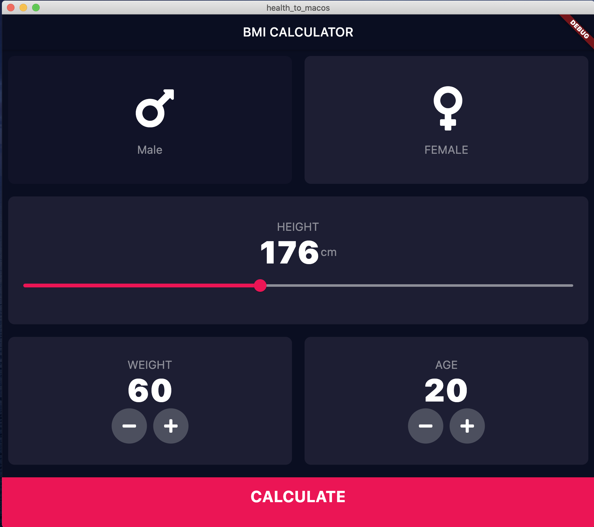
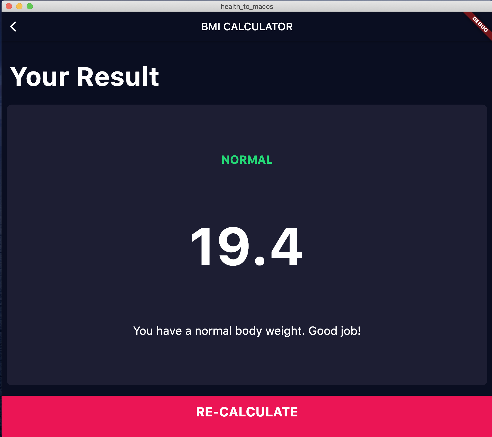
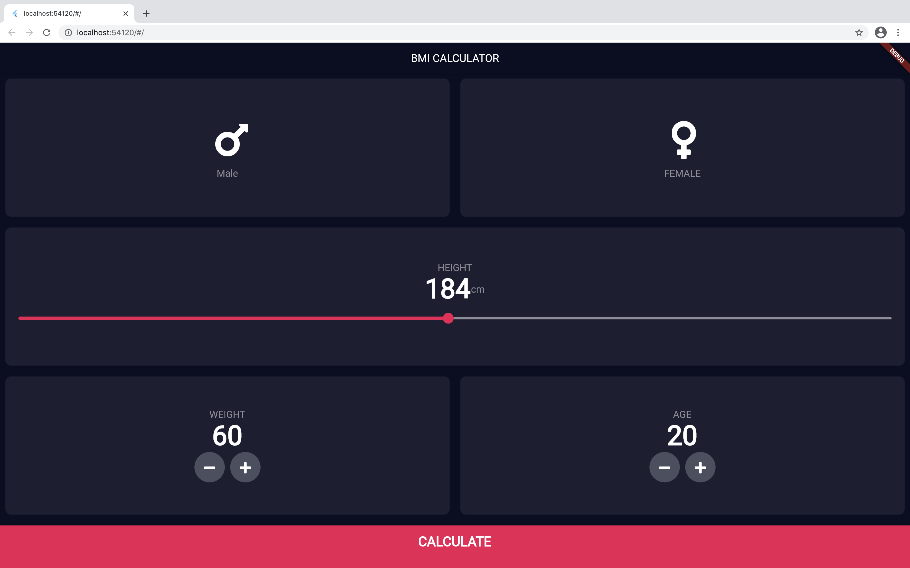

# health_to_macos_and_web

This is a simple project to test the development of a desktop and Web flutter project. Specifically for MacOS to Desktop

## Getting Started

To run desktop version you need have MacOS:

- flutter run -d macos

To run web version:

- flutter run -d chrome

## Screenshot

